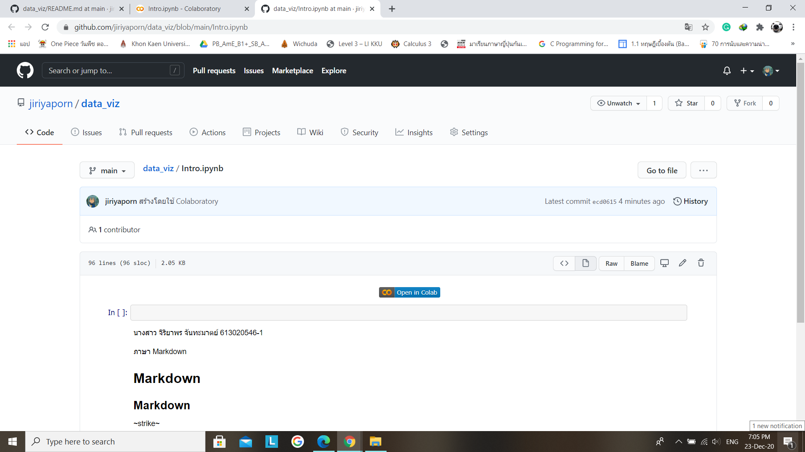

# data_viz
# จิริยาพร จันทะมาตย์ 613020546-1

ตัวอย่างการแทรกรูป

insert img

HW1 การบันทึกไฟล์ Colab ไปยัง gihab
1. เปิดไฟล์งานใน "Colab" แล้วเลือกไฟล์จากนั้นกด "บันทึกสำเนาในGitHab"

2. เมื่อเลือก "บันทึกสำเนาในGitHab" แล้วจะขึ้นหน้าต่างนี้ ตรงข้อความคอมมิตสามารถแก้ไขชื่อได้ หลังจากนั้นกด "ตกลง"

3. เมื่อกดตกลงแล้ว ไฟล์งานใน Colab จะแสดงใน GitHab 

