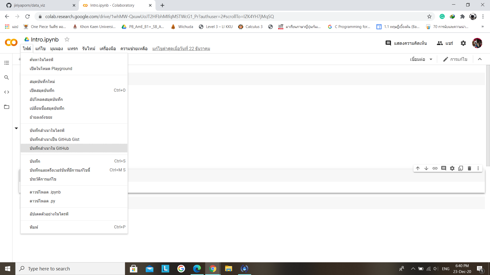
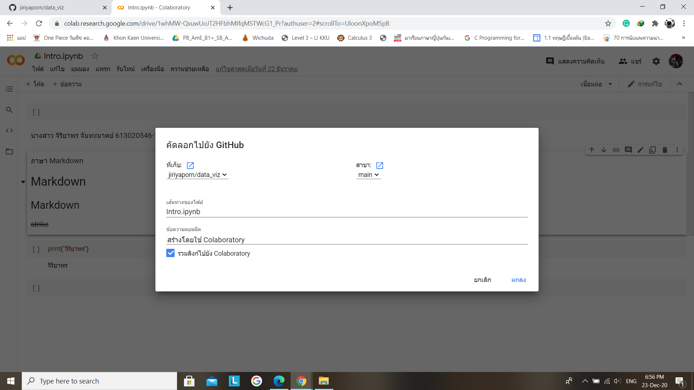

# data_viz
# จิริยาพร จันทะมาตย์ 613020546-1

ตัวอย่างการแทรกรูป

insert img

การบันทึกไฟล์ Colab ไปยัง gihab
1. เปิดไฟล์งานใน Colab แล้วเลือกไฟล์จากนั้นกด บันทึกสำเนาในGitHab

2. เมื่อเลือก บันทึกสำเนาในGitHab แล้วจะขึ้นหน้าต่างนี้ แล้วกดตกลง

